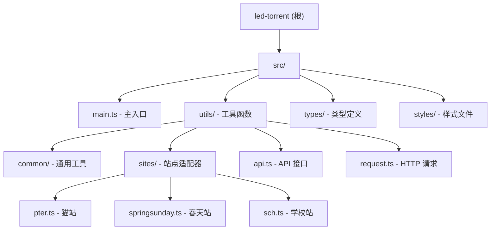

# LED Torrent 一键领种/弃种脚本

> 为 PT 站点提供一键领种、一键弃种功能的 Tampermonkey 用户脚本

## 变更记录

### 2026-01-14
- 初始化 AI 上下文文档
- 完成项目架构分析与模块文档生成
- 生成模块级 CLAUDE.md 文档

---

## 项目愿景

LED Torrent 是一个专为 PT（Private Tracker）站点设计的浏览器用户脚本，旨在简化用户在多个 PT 站点上的种子管理操作。通过自动化领种和弃种流程，帮助用户快速管理大量种子，提升使用体验。

**核心目标**：
- 支持多个主流 PT 站点的一键操作
- 提供友好的用户界面和实时反馈
- 保持轻量级和高性能
- 易于扩展新站点支持

---

## 架构总览

本项目是一个 **TypeScript + Vite** 构建的 Tampermonkey 用户脚本，采用模块化架构设计：

### 技术栈

- **语言**：TypeScript 5.9+
- **构建工具**：Vite 7
- **用户脚本插件**：vite-plugin-monkey
- **样式预处理器**：SCSS
- **代码规范**：@antfu/eslint-config
- **运行环境**：浏览器 Tampermonkey/Greasemonkey

### 项目特点

- 零运行时依赖（纯浏览器 API）
- 完整的 TypeScript 类型定义
- 模块化的站点适配器设计
- 优雅的按钮动画和用户反馈

---

## 模块结构图



---

## 模块索引

| 模块路径 | 职责描述 | 语言 | 状态 |
|---------|---------|------|------|
| [src/](./src/CLAUDE.md) | 源代码根目录，包含所有前端代码 | TypeScript | ✅ 已扫描 |
| [src/main.ts](./src/CLAUDE.md#入口与启动) | 主入口，UI 初始化与路由分发 | TypeScript | ✅ 已扫描 |
| [src/utils/](./src/utils/CLAUDE.md) | 工具函数集合，核心业务逻辑 | TypeScript | ✅ 已扫描 |
| [src/utils/api.ts](./src/utils/CLAUDE.md#2-api-接口模块-apits) | PT 站点 API 接口封装 | TypeScript | ✅ 已扫描 |
| [src/utils/request.ts](./src/utils/CLAUDE.md#1-http-请求模块-requestts) | HTTP 请求封装（带超时） | TypeScript | ✅ 已扫描 |
| [src/utils/common/](./src/utils/CLAUDE.md#3-通用站点处理-commonsitts) | 通用工具函数（URL 解析、DOM 检查等） | TypeScript | ✅ 已扫描 |
| [src/utils/sites/](./src/utils/CLAUDE.md#4-站点适配器-sites) | 各站点适配器实现 | TypeScript | ✅ 已扫描 |
| [src/utils/sites/pter.ts](./src/utils/CLAUDE.md#猫站适配器-pterts) | 猫站（pterclub.com）适配 | TypeScript | ✅ 已扫描 |
| [src/utils/sites/springsunday.ts](./src/utils/CLAUDE.md#春天站适配器-springsundayts) | 春天站（springsunday.net）适配 | TypeScript | ✅ 已扫描 |
| [src/utils/sites/sch.ts](./src/utils/CLAUDE.md#学校站适配器-schts) | 学校站（btschool.club）适配 | TypeScript | ✅ 已扫描 |
| [src/types/](./src/types/CLAUDE.md) | TypeScript 类型定义 | TypeScript | ✅ 已扫描 |
| [src/styles/](./src/styles/CLAUDE.md) | SCSS 样式文件 | SCSS | ✅ 已扫描 |

---

## 运行与开发

### 安装依赖

```bash
pnpm install
```

### 开发模式

```bash
pnpm dev
```

开发模式下，Vite 会自动监听文件变化并重新构建，生成的用户脚本可以直接在 Tampermonkey 中导入使用。

### 构建

```bash
pnpm build
```

构建产物位于 `dist/` 目录，生成完整的 `.user.js` 文件。

### 代码检查

```bash
pnpm lint
```

使用 ESLint 进行代码检查和自动修复。

---

## 测试策略

⚠️ **当前状态**：项目暂无自动化测试

- 测试目录：不存在
- 测试文件：未发现
- 建议：为核心功能（API 请求、DOM 解析）添加单元测试

### 建议的测试框架

- **Vitest** - 与 Vite 深度集成的测试框架
- **@testing-library/dom** - DOM 测试工具

### 测试覆盖范围建议

1. **单元测试**
   - API 请求函数（`request.ts`）
   - 工具函数（`getvl`、`checkForNextPage`）
   - DOM 解析逻辑

2. **集成测试**
   - 完整的领种流程
   - 分页加载逻辑
   - 错误处理

---

## 编码规范

项目采用 **@antfu/eslint-config** 代码风格：

### 基本配置

- **缩进**：2 空格
- **引号**：单引号
- **分号**：无分号
- **排序**：import 语句按注释块分组自然排序
- **命名**：camelCase（变量/函数）、PascalCase（类/类型）

### 注释规范

#### 文件头注释

所有文件包含标准文件头注释：

```typescript
/*
 * @Author: yanghongxuan
 * @Date: YYYY-MM-DD HH:mm:ss
 * @LastEditors: yanghongxuan
 * @LastEditTime: YYYY-MM-DD HH:mm:ss
 * @Description: 文件描述
 */
```

#### 函数注释

函数使用 JSDoc 注释：

```typescript
/**
 * 函数功能描述
 *
 * @param param1 - 参数1说明
 * @param param2 - 参数2说明
 * @returns 返回值说明
 */
```

---

## AI 使用指引

### 适合 AI 辅助的任务

#### 1. 添加新站点适配器

**参考指南**：[utils 模块文档 - 常见问题](./src/utils/CLAUDE.md#q1-如何添加新站点支持)

**步骤**：
1. 在 `src/utils/sites/` 下创建新文件
2. 实现 `load*UserTorrents` 和 `handleLed*Torrent` 函数
3. 在 `src/utils/api.ts` 中添加站点特定的 API 调用函数
4. 在 `src/main.ts` 中添加路由判断
5. 在 `src/utils/index.ts` 中导出新函数

**示例结构**：
```typescript
// src/utils/sites/newsite.ts
export async function loadNewSiteUserTorrents(
  userid: string,
  allData: TorrentDataIdsType,
  ledlist: string[]
) {
  // 1. 调用 API 获取 HTML
  // 2. 使用 DOMParser 解析
  // 3. 使用 querySelector 提取数据
  // 4. 支持分页（checkForNextPage）
}

export async function handleLedNewSiteTorrent(
  arr: TorrentDataIdsType,
  button: HTMLButtonElement,
  json: Record<string, number>
) {
  // 1. 遍历数组
  // 2. 调用 API
  // 3. 更新按钮和统计
}
```

#### 2. 优化用户界面

**参考指南**：[styles 模块文档](./src/styles/CLAUDE.md)

**可修改项**：
- 按钮颜色和尺寸
- 容器位置和布局
- 消息列表样式
- 动画效果

#### 3. 增强错误处理

**参考指南**：[utils 模块文档 - request.ts](./src/utils/CLAUDE.md#1-http-请求模块-requestts)

**改进方向**：
- 完善各个 API 调用的错误处理
- 添加请求重试机制
- 提供更友好的用户提示

#### 4. 性能优化

**优化方向**：
- 优化大量种子处理的并发控制
- 添加请求节流和防抖
- 减少不必要的 DOM 操作

---

### 关键上下文

#### 入口文件

**位置**：`src/main.ts`

**职责**：
- 所有 UI 初始化
- 站点 URL 路由判断
- 事件监听器绑定

#### API 定义

**位置**：`src/utils/api.ts`

**包含**：
- 所有 PT 站点的 API 接口定义
- 请求参数和响应类型

#### 请求封装

**位置**：`src/utils/request.ts`

**特性**：
- 统一的 HTTP 请求方法
- 支持超时控制（默认 100 秒）
- 特殊响应处理

#### 站点适配器

**位置**：`src/utils/sites/`

**功能**：
- 各站点的 DOM 解析逻辑
- 站点特定的领种/弃种处理

---

### 扩展指南

#### 添加新站点支持的标准流程

1. **创建站点适配器文件**
   ```bash
   src/utils/sites/newsite.ts
   ```

2. **实现两个核心函数**
   ```typescript
   // 加载用户种子数据
   loadNewSiteUserTorrents(userid, allData, ledlist)

   // 处理领种操作
   handleLedNewSiteTorrent(arr, button, json)
   ```

3. **添加 API 接口**
   ```typescript
   // src/utils/api.ts
   export async function getNewSiteApi(params) { ... }
   export async function getNewSiteLedTorrent(id) { ... }
   ```

4. **更新路由配置**
   ```typescript
   // src/main.ts
   if (location.href.includes('newsite.com/userdetails.php')) {
     button.textContent = '一键认领'
     setupButtonListener(button, () =>
       handleTorrentsActions(button, ulbox, getvl('id'), 'claimNewSite'))
   }
   ```

5. **导出函数**
   ```typescript
   // src/utils/index.ts
   export * from './sites/newsite'
   ```

---

## 已知问题与限制

### 功能限制

1. **无测试覆盖**
   - 项目当前没有单元测试或集成测试
   - 建议：添加 Vitest 测试框架

2. **硬编码 URL**
   - 站点 URL 匹配逻辑分散在 `main.ts` 中
   - 建议：提取到配置文件

3. **错误恢复**
   - 部分 API 调用失败时缺少重试机制
   - 建议：添加指数退避重试

4. **国际化**
   - 仅支持简体中文界面
   - 建议：添加 i18n 支持

### 技术债务

1. **性能优化**
   - 大量种子处理时可能卡顿
   - 建议：添加并发控制和分批处理

2. **代码重复**
   - 各站点适配器有重复逻辑
   - 建议：提取公共函数

3. **类型安全**
   - 部分 API 响应缺少类型定义
   - 建议：完善类型定义

---

## 支持的站点

| 站点名称 | 域名 | 适配器文件 | 状态 |
|---------|------|-----------|------|
| 猫站 | pterclub.com | `pter.ts` | ✅ 已支持 |
| 春天站 | springsunday.net | `springsunday.ts` | ✅ 已支持 |
| 学校站 | btschool.club | `sch.ts` | ✅ 已支持 |
| 通用站点 | * (Nexus PHP) | `site.ts` | ✅ 已支持 |

---

## 相关文件清单

### 配置文件

- `package.json` - 项目元信息和依赖
- `tsconfig.json` - TypeScript 编译配置
- `vite.config.ts` - Vite 构建配置（含 monkey 插件）
- `eslint.config.js` - ESLint 代码规范配置
- `.gitignore` - Git 忽略规则

### 源代码文件

```
src/
├── main.ts                    # 主入口（198 行）
├── vite-env.d.ts             # Vite 环境类型声明
├── utils/
│   ├── index.ts              # 工具函数导出（52 行）
│   ├── api.ts                # API 接口封装（158 行）
│   ├── request.ts            # HTTP 请求封装（106 行）
│   ├── common/
│   │   ├── index.ts          # 通用工具函数（43 行）
│   │   └── site.ts           # 通用站点处理函数（138 行）
│   └── sites/
│       ├── pter.ts           # 猫站适配器（83 行）
│       ├── springsunday.ts   # 春天站适配器（85 行）
│       └── sch.ts            # 学校站适配器（63 行）
├── types/
│   ├── api.d.ts              # API 类型定义（25 行）
│   └── index.d.ts            # 通用类型定义（3 行）
└── styles/
    └── led-torrent.scss      # 样式文件（212 行）
```

**总计**：约 1166 行代码

---

## 许可证

未明确声明（需补充）

---

## 联系方式

- 作者：yanghongxuan (waibuzheng)
- 项目路径：E:\工作\study\led-torrent
- 文档生成时间：2026-01-14 22:57:31
