# LED Torrent 一键领种/弃种脚本

> 为 PT 站点提供一键领种、一键弃种功能的 Tampermonkey 用户脚本

---

## 变更记录

### 2026-01-15 00:13:34

- 重构项目架构，实现模块化分层设计
- 新增路由系统（`router/`）统一管理站点路由
- 新增适配器层（`adapters/`）基于基类实现站点适配
- 新增核心模块（`core/`）提供 API、请求、并发控制、类型定义
- 新增 UI 层（`ui/`）统一管理界面组件
- 重构工具函数（`utils/`）为纯函数工具库
- 生成完整模块文档和 Mermaid 结构图

### 2026-01-14

- 初始化 AI 上下文文档
- 完成项目架构分析与模块文档生成

---

## 项目愿景

LED Torrent 是一个专为 PT（Private Tracker）站点设计的浏览器用户脚本，旨在简化用户在多个 PT 站点上的种子管理操作。通过自动化领种和弃种流程，帮助用户快速管理大量种子，提升使用体验。

**核心目标**：

- 支持多个主流 PT 站点的一键操作
- 提供友好的用户界面和实时反馈
- 保持轻量级和高性能
- 易于扩展新站点支持

---

## 架构总览

本项目是一个 **TypeScript + Vite** 构建的 Tampermonkey 用户脚本，采用**分层模块化架构**设计：

### 技术栈

- **语言**：TypeScript 5.9+
- **构建工具**：Vite 7
- **用户脚本插件**：vite-plugin-monkey
- **样式预处理器**：SCSS
- **代码规范**：@antfu/eslint-config
- **运行环境**：浏览器 Tampermonkey/Greasemonkey

### 架构特点

- **分层架构**：路由 → 适配器 → 核心 → UI 清晰分离
- **OOP 设计**：使用基类和接口消除重复代码
- **零运行时依赖**：纯浏览器 API
- **完整类型定义**：TypeScript 严格模式
- **并发控制**：防止请求过载导致站点压力

---

## 模块结构图

```mermaid
graph TD
    Root["led-torrent (根)"]

    Root --> Src["src/ - 源代码根目录"]

    %% 入口层
    Src --> Main["main.ts - 应用启动入口"]

    %% 路由层
    Src --> Router["router/ - 路由系统"]
    Router --> RouterIndex["index.ts - 路由分发器"]
    Router --> Routes["routes.ts - 路由配置"]

    %% 适配器层
    Src --> Adapters["adapters/ - 站点适配器"]
    Adapters --> AdapterIndex["index.ts - 统一导出"]
    Adapters --> AdapterBase["base.ts - 基类与接口"]
    Adapters --> AdapterCommon["common.ts - 通用站点"]
    Adapters --> AdapterPter["pter.ts - 猫站"]
    Adapters --> AdapterSpring["springsunday.ts - 春天站"]

    %% 核心层
    Src --> Core["core/ - 核心基础设施"]
    Core --> CoreAPI["api.ts - API 接口定义"]
    Core --> CoreRequest["request.ts - HTTP 请求"]
    Core --> CoreConcurrent["concurrent.ts - 并发控制"]
    Core --> CoreTypes["types.ts - 类型定义"]

    %% UI 层
    Src --> UI["ui/ - UI 组件"]
    UI --> UIIndex["index.ts - 统一导出"]
    UI --> UIComponents["components.ts - 组件实现"]

    %% 工具层
    Src --> Utils["utils/ - 工具函数"]
    Utils --> UtilsIndex["index.ts - 统一导出"]
    Utils --> UtilsDom["dom.ts - DOM 工具"]
    Utils --> UtilsFormat["format.ts - 格式化工具"]
    Utils --> UtilsUrl["url.ts - URL 工具"]

    %% 样式层
    Src --> Styles["styles/ - 样式文件"]
    Styles --> StylesMain["led-torrent.scss - 主样式"]
    Styles --> StylesVars["_variables.scss - 变量"]
    Styles --> StylesComponents["components/ - 组件样式"]

    %% 类型层
    Src --> Types["types/ - 类型定义（已废弃）"]

    %% 点击链接
    click Main "#src-main-ts"
    click Router "#src-router"
    click Adapters "#src-adapters"
    click Core "#src-core"
    click UI "#src-ui"
    click Utils "#src-utils"
    click Styles "#src-styles"
```



---

## 模块索引

| 模块路径 | 职责描述 | 语言 | 状态 |
| --- | --- | --- | --- |
| **应用入口** |||
| [src/main.ts](#src-main-ts) | 应用启动入口，初始化路由和样式 | TypeScript | ✅ 已重构 |
| **路由层** |||
| [src/router/](#src-router) | 路由系统，负责 URL 匹配和事件处理 | TypeScript | ✅ 新增 |
| [src/router/index.ts](#src-router) | 路由分发器，初始化应用和匹配路由 | TypeScript | ✅ 已扫描 |
| [src/router/routes.ts](#src-router) | 路由配置，定义各站点的匹配规则 | TypeScript | ✅ 已扫描 |
| **适配器层** |||
| [src/adapters/](#src-adapters) | 站点适配器，实现各站点的业务逻辑 | TypeScript | ✅ 已重构 |
| [src/adapters/base.ts](#src-adapters) | 适配器基类和接口定义 | TypeScript | ✅ 已扫描 |
| [src/adapters/common.ts](#src-adapters) | 通用站点适配器（Nexus PHP） | TypeScript | ✅ 已扫描 |
| [src/adapters/pter.ts](#src-adapters) | 猫站适配器（pterclub.com） | TypeScript | ✅ 已扫描 |
| [src/adapters/springsunday.ts](#src-adapters) | 春天站适配器（springsunday.net） | TypeScript | ✅ 已扫描 |
| **核心层** |||
| [src/core/](#src-core) | 核心基础设施，提供底层能力 | TypeScript | ✅ 新增 |
| [src/core/api.ts](#src-core-api) | API 接口定义，所有站点的 API | TypeScript | ✅ 已扫描 |
| [src/core/request.ts](#src-core-request) | HTTP 请求封装，支持超时 | TypeScript | ✅ 已扫描 |
| [src/core/concurrent.ts](#src-core-concurrent) | 并发控制和速率限制器 | TypeScript | ✅ 已扫描 |
| [src/core/types.ts](#src-core-types) | 核心类型定义 | TypeScript | ✅ 已扫描 |
| **UI 层** |||
| [src/ui/](#src-ui) | UI 组件，统一管理界面 | TypeScript | ✅ 新增 |
| [src/ui/components.ts](#src-ui-components) | UI 组件实现（UIManager、UICreator、ButtonAnimator） | TypeScript | ✅ 已扫描 |
| **工具层** |||
| [src/utils/](#src-utils) | 工具函数库，纯函数集合 | TypeScript | ✅ 已重构 |
| [src/utils/dom.ts](#src-utils-dom) | DOM 工具函数（checkForNextPage） | TypeScript | ✅ 已扫描 |
| [src/utils/format.ts](#src-utils-format) | 格式化工具（getLedMsg） | TypeScript | ✅ 已扫描 |
| [src/utils/url.ts](#src-utils-url) | URL 工具（getvl） | TypeScript | ✅ 已扫描 |
| **样式层** |||
| [src/styles/](#src-styles) | SCSS 样式文件 | SCSS | ✅ 已扫描 |
| [src/styles/led-torrent.scss](#src-styles) | 主样式文件，按钮和容器样式 | SCSS | ✅ 已扫描 |

---

## 运行与开发

### 安装依赖

```bash
pnpm install
```

### 开发模式

```bash
pnpm dev
```

开发模式下，Vite 会自动监听文件变化并重新构建，生成的用户脚本可以直接在 Tampermonkey 中导入使用。

### 构建

```bash
pnpm build
```

构建产物位于 `dist/` 目录，生成完整的 `.user.js` 文件。

### 代码检查

```bash
pnpm lint
```

使用 ESLint 进行代码检查和自动修复。

---

## 测试策略

⚠️ **当前状态**：项目暂无自动化测试

- 测试目录：不存在
- 测试文件：未发现
- 建议：为核心功能（API 请求、DOM 解析、并发控制）添加单元测试

### 建议的测试框架

- **Vitest** - 与 Vite 深度集成的测试框架
- **@testing-library/dom** - DOM 测试工具

### 测试覆盖范围建议

1. **单元测试**
   - API 请求函数（`request.ts`）
   - 工具函数（`getvl`、`checkForNextPage`、`getLedMsg`）
   - DOM 解析逻辑
   - 并发控制器（`ConcurrentPool`、`RateLimiter`）

2. **集成测试**
   - 完整的领种流程
   - 分页加载逻辑
   - 错误处理和重试机制

---

## 编码规范

项目采用 **@antfu/eslint-config** 代码风格：

### 基本配置

- **缩进**：2 空格
- **引号**：单引号
- **分号**：无分号
- **排序**：import 语句按注释块分组自然排序
- **命名**：camelCase（变量/函数）、PascalCase（类/类型）

### 注释规范

#### 文件头注释

所有文件包含标准文件头注释：

```typescript
/*
 * @Author: yanghongxuan
 * @Date: YYYY-MM-DD HH:mm:ss
 * @LastEditors: yanghongxuan
 * @LastEditTime: YYYY-MM-DD HH:mm:ss
 * @Description: 文件描述
 */
```

#### 函数注释

函数使用 JSDoc 注释：

```typescript
/**
 * 函数功能描述
 *
 * @param param1 - 参数1说明
 * @param param2 - 参数2说明
 * @returns 返回值说明
 */
```

---

## AI 使用指引

### 适合 AI 辅助的任务

#### 1. 添加新站点适配器

**参考指南**：[adapters/base.ts](src/adapters/base.ts) - 基类和接口定义

**步骤**：

1. 在 `src/adapters/` 下创建新文件（如 `newsite.ts`）
2. 继承 `BaseSiteAdapter` 抽象类
3. 实现四个抽象方法：
   - `fetchPageData` - 获取页面数据
   - `parsePageData` - 解析页面数据
   - `hasNextPage` - 检查是否有下一页
   - `claimOneTorrent` - 领取单个种子
4. 在 `src/router/routes.ts` 中添加路由配置
5. 在 `src/core/api.ts` 中添加站点特定的 API 函数
6. 在 `src/adapters/index.ts` 中导出适配器

**示例结构**：

```typescript
// src/adapters/newsite.ts
import { BaseSiteAdapter, DOMHelper } from './base'
import type { TorrentDataIdsType } from '@/core/types'
import { getNewSiteApi } from '@/core/api'

class NewSiteAdapter extends BaseSiteAdapter {
  siteName = '新站点'

  protected async fetchPageData(page: number, userid: string): Promise<string> {
    return getNewSiteApi({ page, userid })
  }

  protected parsePageData(html: string, allData: TorrentDataIdsType, ledlist: string[]): void {
    const parser = new DOMParser()
    const doc = parser.parseFromString(html, 'text/html')

    // 使用 DOMHelper 提取数据
    const items = doc.querySelectorAll('.torrent-item')
    items.forEach((item) => {
      const id = DOMHelper.getAttr(item, 'data-id')
      if (id && !allData.includes(id)) {
        allData.push(id)
      }
    })
  }

  protected hasNextPage(doc: Document, page: number, userid: string): boolean {
    return DOMHelper.checkNextPage(doc, `a[href*="?page=${page}"]`)
  }

  protected async claimOneTorrent(id: string): Promise<string> {
    try {
      const data = await claimNewSiteTorrent(id)
      return data.ret === 0 ? '领取成功' : '领取失败'
    } catch {
      return '领取失败'
    }
  }
}

export const newSiteAdapter = new NewSiteAdapter()
```

#### 2. 优化用户界面

**参考指南**：[ui/components.ts](src/ui/components.ts) - UI 组件实现

**可修改项**：

- 按钮颜色和尺寸（`styles/_variables.scss`）
- 容器位置和布局（`styles/components/_container.scss`）
- 消息列表样式（`styles/components/_message-list.scss`）
- 动画效果（`styles/animations/_index.scss`）

#### 3. 增强错误处理

**参考指南**：[core/request.ts](src/core/request.ts) - HTTP 请求封装

**改进方向**：

- 完善各个 API 调用的错误处理
- 添加请求重试机制
- 提供更友好的用户提示

#### 4. 性能优化

**优化方向**：

- 使用 `BatchTaskExecutor` 控制并发
- 调整速率限制参数
- 优化 DOM 操作频率

---

### 关键上下文

#### 入口文件

**位置**：`src/main.ts`

**职责**：

- 导入主样式文件
- 调用 `initApp()` 初始化应用

**代码**：

```typescript
import { initApp } from '@/router'
import '@/styles/led-torrent.scss'

initApp()
```

#### 路由系统

**位置**：`src/router/`

**职责**：

- 匹配当前 URL 到对应的站点
- 创建 UI 组件
- 绑定事件监听器
- 调用适配器处理业务逻辑

#### 适配器模式

**位置**：`src/adapters/`

**设计模式**：策略模式 + 模板方法模式

**基类**：`BaseSiteAdapter` 提供通用流程

**子类**：实现站点特定的解析和操作逻辑

#### 核心模块

**位置**：`src/core/`

**功能**：

- `api.ts` - 所有 PT 站点的 API 接口
- `request.ts` - 统一的 HTTP 请求方法
- `concurrent.ts` - 并发控制和速率限制
- `types.ts` - TypeScript 类型定义

#### UI 组件

**位置**：`src/ui/`

**组件**：

- `UIManager` - UI 管理器，批量更新减少 DOM 操作
- `UICreator` - UI 元素创建器
- `ButtonAnimator` - 按钮动画控制器

---

### 扩展指南

#### 添加新站点支持的标准流程

1. **创建站点适配器文件**

   ```bash
   src/adapters/newsite.ts
   ```

2. **实现适配器类**

   ```typescript
   class NewSiteAdapter extends BaseSiteAdapter {
     // 实现四个抽象方法
   }
   ```

3. **添加 API 接口**

   ```typescript
   // src/core/api.ts
   export async function getNewSiteApi(params) { ... }
   export async function getNewSiteLedTorrent(id) { ... }
   ```

4. **更新路由配置**

   ```typescript
   // src/router/routes.ts
   export const ROUTES: RouteConfig[] = [
     {
       name: '新站点领种',
       pattern: 'newsite.com/userdetails.php',
       buttonText: '一键认领',
       action: 'claimNewSite',
       userIdParam: 'id',
     },
   ]
   ```

5. **导出适配器**
   ```typescript
   // src/adapters/index.ts
   export * from './newsite'
   ```

6. **在路由中使用**

   ```typescript
   // src/router/index.ts
   import { loadNewSiteUserTorrents, handleLedNewSiteTorrent } from '@/adapters'

   // 在 handleTorrentsActions 中添加对应的 action 处理
   ```

---

## 已知问题与限制

### 功能限制

1. **无测试覆盖**
   - 项目当前没有单元测试或集成测试
   - 建议：添加 Vitest 测试框架

2. **硬编码 URL**
   - 站点 URL 匹配逻辑分散在 `routes.ts` 中
   - 建议：提取到配置文件

3. **错误恢复**
   - 部分 API 调用失败时缺少重试机制
   - 建议：添加指数退避重试

4. **国际化**
   - 仅支持简体中文界面
   - 建议：添加 i18n 支持

### 技术债务

1. **性能优化**
   - 大量种子处理时可能卡顿
   - 已添加并发控制，但可能需要进一步优化

2. **代码重复**
   - 各站点适配器有重复的 UI 创建逻辑
   - 已通过基类部分消除，需要进一步抽象

3. **类型安全**
   - 部分 API 响应缺少详细类型定义
   - 建议：完善类型定义

---

## 支持的站点

| 站点名称 | 域名 | 适配器文件 | 状态 |
| --- | --- | --- | --- |
| 猫站 | pterclub.com | `pter.ts` | ✅ 已支持 |
| 春天站 | springsunday.net | `springsunday.ts` | ✅ 已支持 |
| 通用站点 | * (Nexus PHP) | `common.ts` | ✅ 已支持 |

---

## 相关文件清单

### 配置文件

- `package.json` - 项目元信息和依赖
- `tsconfig.json` - TypeScript 编译配置
- `vite.config.ts` - Vite 构建配置（含 monkey 插件）
- `eslint.config.js` - ESLint 代码规范配置
- `.gitignore` - Git 忽略规则

### 源代码文件

```
src/
├── main.ts                    # 主入口（17 行）✅ 已简化
├── vite-env.d.ts             # Vite 环境类型声明
├── router/                   # 路由系统 ✅ 新增
│   ├── index.ts              # 路由分发器（189 行）
│   └── routes.ts             # 路由配置（93 行）
├── adapters/                 # 站点适配器 ✅ 已重构
│   ├── index.ts              # 统一导出（20 行）
│   ├── base.ts               # 基类和接口（246 行）
│   ├── common.ts             # 通用站点（153 行）
│   ├── pter.ts               # 猫站（133 行）
│   └── springsunday.ts       # 春天站（135 行）
├── core/                     # 核心基础设施 ✅ 新增
│   ├── api.ts                # API 接口（143 行）
│   ├── request.ts            # HTTP 请求（128 行）
│   ├── concurrent.ts         # 并发控制（185 行）
│   └── types.ts              # 类型定义（39 行）
├── ui/                       # UI 组件 ✅ 新增
│   ├── index.ts              # 统一导出（11 行）
│   └── components.ts         # 组件实现（214 行）
├── utils/                    # 工具函数 ✅ 已重构
│   ├── index.ts              # 统一导出（17 行）
│   ├── dom.ts                # DOM 工具（22 行）
│   ├── format.ts             # 格式化工具（22 行）
│   └── url.ts                # URL 工具（23 行）
├── styles/                   # 样式文件
│   ├── led-torrent.scss      # 主样式（212 行）
│   ├── _variables.scss       # 变量定义
│   ├── animations/           # 动画样式
│   └── components/           # 组件样式
└── types/                    # 类型定义（已废弃，迁移到 core/）
```

**总计**：约 2000+ 行代码（重构后）

---

## 许可证

未明确声明（需补充）

---

## 联系方式

- 作者：yanghongxuan (waibuzheng)
- 项目路径：E:\工作\study\led-torrent
- 文档生成时间：2026-01-15 00:13:34
